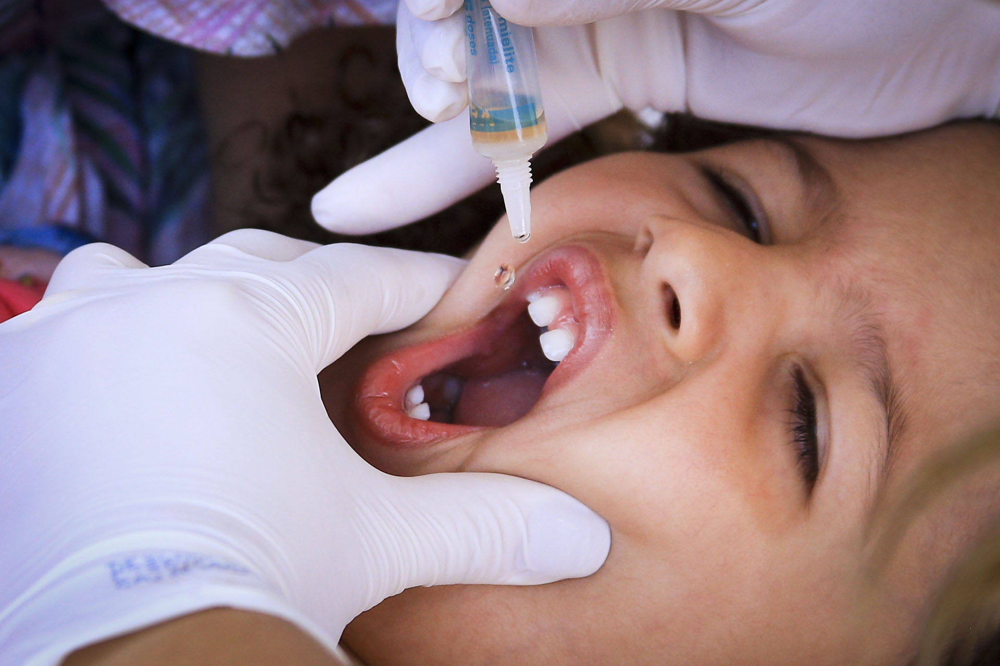

 

Imagem da <a href="https://www.agenciabrasilia.df.gov.br/2020/11/08/cobertura-vacinal-de-473-contra-poliomielite-ainda-reflete-baixa/">Agência Brasilia</a>

    
Filipi Rigui

       
    

 

Notebook com a análise exploratória: [**Análise da Poliomielite no Brasil**](./notebooks/analise_polio_brasil.ipynb)

# Cobertura da vacinal contra **Poliomielite** no Brasil vem diminuindo e atinge menor marca da ultima decada
A Cobertura vacinal contra a **Poliomielite** no Brasil  vêm caindo na ultima década, numa taxa de **-1,95% ao ano**, saindo de **100% em 2010** para menos de **85% em 2020**, abaixo da Méta da **OMS (Organização Mundial da Saúde)** para a erradicação da **Pólio** no mundo, que é de **95% da população alvo**.

## Um pouco mais sobre a **Poliomielite**
### O que é a Poliomielite?
>A **poliomielite**, também chamada de **pólio** ou **paralisia infantil**, é uma doença infecciosa viral aguda transmitida de pessoa a pessoa, principalmente pela via [fecal-oral](https://pt.wikipedia.org/wiki/Rota_fecal-oral). O termo deriva do [grego](https://pt.wikipedia.org/wiki/L%C3%ADngua_grega) poliós (πολιός), que significa "cinza", myelós (µυελός "medula"), referindo-se à substância cinzenta da [medula espinhal](https://pt.wikipedia.org/wiki/Medula_espinhal), e o sufixo -itis, que denota [inflamação](https://pt.wikipedia.org/wiki/Inflama%C3%A7%C3%A3o), ou seja, inflamação da substância cinzenta da medula espinhal. Contudo, algumas infecções mais graves podem se estender até o [tronco encefálico](https://pt.wikipedia.org/wiki/Tronco_encef%C3%A1lico) e ainda para estruturas superiores, resultando em polioencefalite, que provoca [apneia](https://pt.wikipedia.org/wiki/Apneia), a qual requer [ventilação mecânica](https://pt.wikipedia.org/wiki/Ventila%C3%A7%C3%A3o_mec%C3%A2nica) com o uso de um [respirador artificial](https://pt.wikipedia.org/wiki/Respirador). 
[**Wikipédia**](https://pt.wikipedia.org/wiki/Poliomielite)

### Transmissão
O vírus da **pólio** pertence ao gênero dos [*enterovirus*](https://pt.wikipedia.org/wiki/Enterovirus) e coloniza principalmente a orofaringe ou o intestino, sendo sendo transmitido principalmente pelas fezes, mais também pela saliva. Esse é um vírus altamente contagioso, que tem a sua transmissão agravada nas seguintes condições:
 - *alta densidade demográfica*
 - Sistema de tratamento de esgoto precário
 - Sistema de tratamento de água precário
 - Falta de higiênte com as mãos e alimentos
 - Falta de infra-estrutura de vacinação
 - Localidade de residência remóta
 - Baixa cobertura vacinal
 - Resistência à vacinação
 
### Fisiopatologia
Em nosso organismo, o vírus infecta as mucosas da faringe e do intestino e passa a se replicar. Quando atinge uma elevada quantidade em nosso organismo, o virus pode chegar até o sistema nervoso, e se isso ocorre, acaba por atacar a medula espinhal ou o cortex motor, onde mais frequentemente vai degenerar um dos membros inferiores (em cerca de 1% das infecções segundo a página da **wikipédia**).

### Prevenção
Segundo a [Fiocruz](http://www.fiocruz.br/biosseguranca/Bis/infantil/poliomielite.htm), a **polio** não tem um tratamento específico, sendo a **vacinação** a medida mais imiportante para evitar o contágio da doença, seguida de medidas de higiene. Casos graves podem ser amenizados com fisioterapia, que ameniza parte da dor e dos demais problemas causados 

## Polio no Brasil
Segundo a fundação [Polioeradication](https://polioeradication.org/polio-today/preparing-for-a-polio-free-world/certification/), que visa erradicar a **pólio** do mundo, as Americas, incluindo o Brasil, receberam o certificado de **Pólio Free** em 1994, certificado esse que se mantém ativo até os dias atuais. 
Segundo o site da fundação, existe uma relação de causa e efeito inversamente proporcional entre a cobertura imunológica e o período no tempo em que se demora para eliminar o foco do virus, além da chance de sofrer mutações, o que dificultaria ainda mais as chances de eliminação do foco da doença. 
O Ultimo caso oficial de **Poliomielite** no Brasil  aconteceu no ano de **1989**, no município de Sousa - PB.

## Cobertura Vacinal no Brasil

Podemos ressaltar na avaliação gráfica os seguintes pontos:
1. No período que compreende **2010 - 2015** é possível identificar uma leve queda na cobertura vacinal
2. A partir do ano de 2016 até o ano de 2020, a cobertura vacinal contra a **Pólio** no Brasil passou a cair vertiginosamente, caindo inclusive abaixo de **95%**, meta estipulado pela OMS no programa de erradicação da **Polio** no mundo.
3. A taxa de variação da cobertura vacinal, na maior parte do tempo se encontra **no quadrante negativo do gráfico, indicando que o sentido do movimento da cobertura vacinal é para baixo**.

## Taxa média de decaimento da cobertura vacinal contra a Pólio no Brasil
Nós vimos gráficamente que a cobertura vacinal está diminuindo ao longo do tempo, agora, será que um modelo de regressão linear poderia nos ajudar a entender como esses dados vem caindo? 
Para tal, foi utilizada a biblioteca **Linregress** que faz a regressão linear. 
Como estamos interessados na taxa média, eu vou utilizar como resposta (Y) `rolling_3`, que por ser filtrado acaba removendo um pouco do ruído. 
`slope = -1.95; rvalue = -0.95; pvalue =  0.000` 

Apesar de o modelo de regressão linear mostrar ótimos resultados estatísticos, e de o Gráfico de relação entre Cobertura Vacinal e os alos da ultima decada (geral) estarem bons, foi observada uma potêncial quebra no padrão de vacinação em 2016. Essa quebra de padrão é mostrada gráficamente no gráfico à direita. Os dois gráficos tem a mesma faixa em x e y, e um intervalo de confiança mais estreito no caso desse gráfico pode levar a imaginar que o erro é menor também.
De qualquer maneira, essa é uma informação que eu, por não conhecer tão bem a área, não tenho competência para avaliar no momento. Por esse motivo, vamos seguir utilizando os dados completos no decorrer da análise

## Cobertura vacinal nos estados brasileiros
A idéia aqui é apresentar 2 gráficos, destacando o estado en que a cobertura vacinal contra a pólio teve o melhor resultado e o estado com o pior resultado na ultima década. Os outros estados vão ser imprimidos em cinza, para evitar confundir o leitor. Os gráficos serão:
1. Gráfico de linhas mostrando o valor da média móvel (filtrado) ao longo da ultima década
2. Grafico de Slope, mostrando a taxa de variação média da cobertura vacinal na ultima década

É possível observar uma tendência geral de diminuição na cobertura vacinal contra a **Pólio** na ultima década.

**Pontos relevantes:**
1. Somente o estado do **Ceará** terminou 2020 com uma cobertura vacinal acima da *meta da OMS*
2. Todos os estados mostram uma queda, no gráfico de slope é possível ver que todos os slopes foram negativos, alguns com maior outros com menor intensidade.
3. Não podemos simplesmente fazer a média, uma vez que precisa se ponderar pela quantidade de indivíduos na faixa davascinação, porém, a análise por estado mostra que não temos somente um ou outro estado muito populoso puxando a média do país para baixo, e sim que essa tendência de diminuição é sistemica em todos os estados do País.

## Cobertura vacinal nos municípios brasileiros
O ano de **2019** foi selecionado para evitar considerar o ano **2020** de pandemia. 
A Idéia aqui é fazer uma análise geral dos municipios, verificando a distribuição de cobertura vacinalm bem como quais seriam os municípios menos imunizados nesse ano, e qual é o valor de cobertura vacinal contra a **Pólio** nesses municípios.]

`Em 2020, somente  9.28% dos municípios do Brasil tiveram a cobertura vacinal contra Póliomielite conforme o proposto pela OMS`

Pontos a observar:
1. A **Média** da cobertura vacial contra a **Pólio** no Brasil em 2019 tem o valor de 94%, mais quando comparado com a **Mediana** que tem 91,5, podemos ver que a média está sendo puxada para cima por causa de poucos municípios, que fogem a regra geral, e que vacinaram em 2019 mais de 200% da população alvo.
2. Esses valores elevados podem ser resultado de alguma campanha de vacinação municipal. Essa pesquisa Não faz parte do escopo desse projeto.
3. Valores altos não são bons indicadores. Eles significam que a população ficou exposta ao viros em algum período anterior, e que as medidas públicas de concientização cotidianas não são eficientes, precisando de campanhas para mobilizar a população.
4. Valores baixos significam exposição ao vírus, e as doenças relacionadas a **Pólio**
5. A média nesse caso não pode ser usada para idéia geral do país, uma vez que se precisa ponderar pela população alvo da vacinação nesse ano, para que então esse dado seja representativo para uma comparação nacional.
5. Não vemos no **#TOP10 piores** uma regionalização, pois temos municípios do Sul ao Norte do país

## Comparação da cobertura vacinal entre tipos diferentes de imunos (Poliomielite, Hepatite e Meningite)

A **Meningococo C** e a **Hepatite B** foram imunos escolhidos por serem umunizantes que apresentam valores desde meados de 2010. 
Aparentemente existe um decaimento na cobertura vacinal, que não está excluasivamnete relacionado com o imuno da **Poliomielite**, uma vez que para outros imunos também vemos um decaimento a partir de meados de 2016.

## Conclusões a cerca da pesquisa

- A **Cobertura Vacinal contra a Poliomielite no Brasil**, objeto fundamental dessa pesquisa, vem caindo consistentemente na ultima década. 
- Desde **2016** A cobertura vacinal do Brasil fica abaixo da méta estipulada pela **OMS** no **Programa de Erradicação da Poliomielite no Mundo**, o que é grave, pela severidade da doença e o risco de exposição.
- **Todas as Unidades Federativas do Brasil**, em maior ou menor proporção, apresentaram **queda na cobertura vacinal contra a Piliomielite na ultima década**
    - O estado do Pará atingiu a menor taxa média de decaimento, com valor de quase **5%** ao ano de retração na cobertura vacinal contra a **Poliomielite**.
    - O Estado do Amapá, em **2020**, vacinou somente 41% das crianças contra a **Poliomielite**, enquanto a **Meta da OMS é de 95%**.
- Uma análise por município mostra que:
    - Olhando para o **TOP 10 municípios que menos imunizaram em 2020** (com menor cobertura vacinal) é possível observar municípios de muitas regiões diferentes: Sul, Sudeste, Centro-Oeste, Norte e Nordeste, logo, parece ser um problema sistêmico para a nação.
    - Os 3 municípios que menos imunizaram em 2020 são: **Nova Viçosa - BA [4.23%], Herval - RS [5.71%] e Borebi - SP [6.98%]**, com valores muito abaixo do recomendado pela **OMS** de **95%**.
    - Somente cerca de **10% dos municípios** estiveram ente a faixa ideal de **95% até 100%**.
    - Os 90% dos municípios que estão acima ou abaixo dessa faixa representa um risco:
        - **Risco Futuro** no caso dos Municípios que imunizaram menos de 95% de sua população alvo.
        - **Risco Passado** no caso dos Municípios que vacinaram mais que 100%, uma vez que essa comunidade ficou exposta ao risco de contaminção até o ano em questão.
- A redução da cobertura vacinal não aparenta ser exclusiva do imuno contra a **Poliomielite**, mais sim um problema relacionado com a imunização em geral, uma vez que vacinas contra a **Meningite e Hepatite** também tiveram um comportamento de certa forma equivalente ao da **Pólio**.

## Proximos passos
- Investigação sobre a relação do crescimento e difusão da ideologia **anti-vac** na internet, talvez buscando pela quantidade de alguns termos chave no *Twitter* por exemplo, e correlacionar com essa diminuição na cobertura vacinal
- Investigar as campanhas de vacinação e dinheiro gasto na publicidade das mesmas.
- Tentar uma entrevista com alguem do departamento de saúde pública (alguém de um posto de saúde, de uma UBS, etc...), para verificar se a categoria clínica consegue justificar o motivo da queda na cobertura.

## Organização do Projeto

    ├── LICENSE
    ├── README.md          <- The top-level README for developers using this project.
    ├── data
    │   └── raw            <- The original, immutable data dump.
    │
    ├── docs               <- A default Sphinx project; see sphinx-doc.org for details
    │
    │
    ├── notebooks          <- Jupyter notebooks. Naming convention is a number (for ordering),
    │                         the creator's initials, and a short `-` delimited description, e.g.
    │                         `1.0-jqp-initial-data-exploration`.
    │
    ├── references         <- Data dictionaries, manuals, and all other explanatory materials.
    │
    ├── reports            <- Generated analysis as HTML, PDF, LaTeX, etc.
    │   └── figures        <- Generated graphics and figures to be used in reporting
    │
    ├── requirements.txt   <- The requirements file for reproducing the analysis environment, e.g.
--------

<small>Project based on the <a target="_blank" href="https://drivendata.github.io/cookiecutter-data-science/">cookiecutter data science project template</a>. #cookiecutterdatascience</small>

 
 
## Referências:
[Agencia Brasília](https://www.agenciabrasilia.df.gov.br/2020/11/08/cobertura-vacinal-de-473-contra-poliomielite-ainda-reflete-baixa/) 
[Sociedade Brasileira de Medicina Tropical](https://www.sbmt.org.br/portal/perigo-de-reintroducao-da-poliomielite/) 
[Wikipédia](https://pt.wikipedia.org/wiki/Poliomielite) 
[Polioeradication](http://polioeradication.org/ ) 
[Fiocruz](http://www.fiocruz.br/biosseguranca/Bis/infantil/poliomielite.htm)
[Organização Pan-Americana de Saúde](https://www.paho.org/pt/topicos/poliomielite)