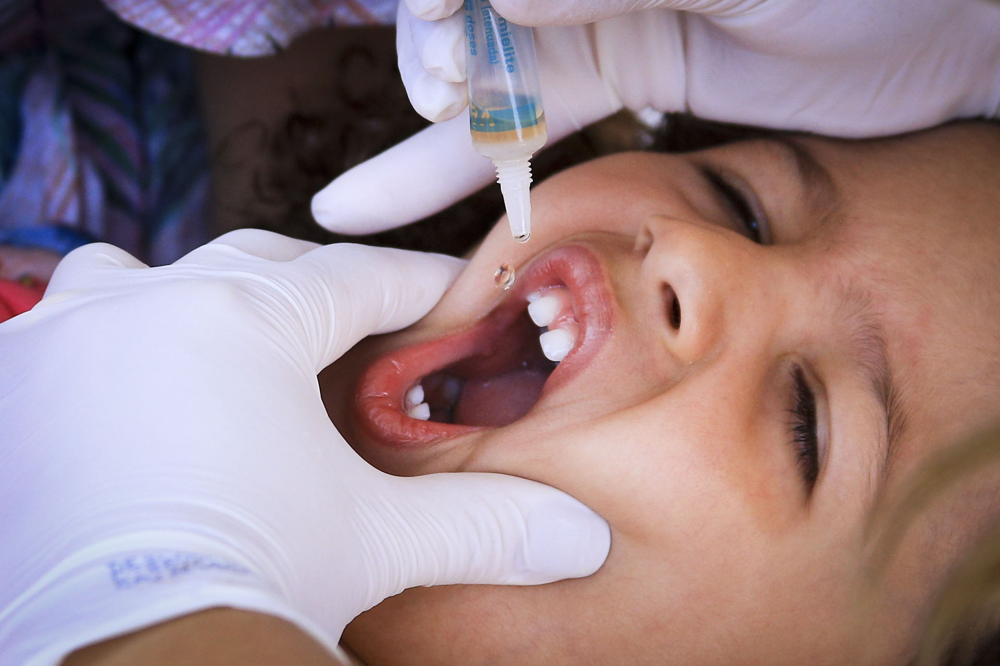

 

Imagem da <a href="https://www.agenciabrasilia.df.gov.br/2020/11/08/cobertura-vacinal-de-473-contra-poliomielite-ainda-reflete-baixa/">Agência Brasilia</a>

    
Filipi Rigui

       
    

 

<i>Para uma melhor imersão visual, abrir projeto no <b>Jupyter ou Google Colab</b></i>

# Cobertura da vacinação contra **Poliomielite** no Brasil vem diminuindo na ultima decada e atinge menor marca da ultima decada
A Cobertura vacinal contra a **Poliomielite** no Brasil  vêm caindo na ultima década, numa taxa de **-2,3% ao ano**, saindo de **100% em 2010** para menos de **85% em 2020**.

## Um pouco mais sobre a **Poliomielite**
### O que é a Poliomielite?
>A **poliomielite**, também chamada de **pólio** ou **paralisia infantil**, é uma doença infecciosa viral aguda transmitida de pessoa a pessoa, principalmente pela via [fecal-oral](https://pt.wikipedia.org/wiki/Rota_fecal-oral). O termo deriva do [grego](https://pt.wikipedia.org/wiki/L%C3%ADngua_grega) poliós (πολιός), que significa "cinza", myelós (µυελός "medula"), referindo-se à substância cinzenta da [medula espinhal](https://pt.wikipedia.org/wiki/Medula_espinhal), e o sufixo -itis, que denota [inflamação](https://pt.wikipedia.org/wiki/Inflama%C3%A7%C3%A3o), ou seja, inflamação da substância cinzenta da medula espinhal. Contudo, algumas infecções mais graves podem se estender até o [tronco encefálico](https://pt.wikipedia.org/wiki/Tronco_encef%C3%A1lico) e ainda para estruturas superiores, resultando em polioencefalite, que provoca [apneia](https://pt.wikipedia.org/wiki/Apneia), a qual requer [ventilação mecânica](https://pt.wikipedia.org/wiki/Ventila%C3%A7%C3%A3o_mec%C3%A2nica) com o uso de um [respirador artificial](https://pt.wikipedia.org/wiki/Respirador). 
[**Wikipédia**](https://pt.wikipedia.org/wiki/Poliomielite)

### Transmissão
O vírus da **pólio** pertence ao gênero dos [*enterovirus*](https://pt.wikipedia.org/wiki/Enterovirus) e coloniza principalmente a orofaringe ou o intestino, sendo sendo transmitido principalmente pelas fezes, mais também pela saliva. Esse é um vírus altamente contagioso, que tem a sua transmissão agravada nas seguintes condições:
 - *alta densidade demográfica*
 - Sistema de tratamento de esgoto precário
 - Sistema de tratamento de água precário
 - Falta de higiênte com as mãos e alimentos
 - Falta de infra-estrutura de vacinação
 - Localidade de residência remóta
 - Baixa cobertura vacinal
 - Resistência à vacinação
 
### Fisiopatologia
Em nosso organismo, o vírus infecta as mucosas da faringe e do intestino e passa a se replicar. Quando atinge uma elevada quantidade em nosso organismo, o virus pode chegar até o sistema nervoso, e se isso ocorre, acaba por atacar a medula espinhal ou o cortex motor, onde mais frequentemente vai degenerar um dos membros inferiores (em cerca de 1% das infecções segundo a página da **wikipédia**).

### Prevenção
Segundo a [Fiocruz](http://www.fiocruz.br/biosseguranca/Bis/infantil/poliomielite.htm), a **polio** não tem um tratamento específico, sendo a **vacinação** a medida mais imiportante para evitar o contágio da doença, seguida de medidas de higiene. Casos graves podem ser amenizados com fisioterapia, que ameniza parte da dor e dos demais problemas causados 

### Polio no Brasil
Segundo a fundação [Polioeradication](https://polioeradication.org/polio-today/preparing-for-a-polio-free-world/certification/), que visa erradicar a **pólio** do mundo, as Americas, incluindo o Brasil, receberam o certificado de **Pólio Free** em 1994, certificado esse que se mantém ativo até os dias atuais. 
Segundo o site da fundação, existe uma relação de causa e efeito inversamente proporcional entre a cobertura imunológica e o período no tempo em que se demora para eliminar o foco do virus, além da chance de sofrer mutações, o que dificultaria ainda mais as chances de eliminação do foco da doença. 
 
 
 
 
 
 

## Referências:
[Agencia Brasília](https://www.agenciabrasilia.df.gov.br/2020/11/08/cobertura-vacinal-de-473-contra-poliomielite-ainda-reflete-baixa/) 
[Sociedade Brasileira de Medicina Tropical](https://www.sbmt.org.br/portal/perigo-de-reintroducao-da-poliomielite/) 
[Wikipédia](https://pt.wikipedia.org/wiki/Poliomielite) 
[Polioeradication](http://polioeradication.org/ ) 
[Fiocruz](http://www.fiocruz.br/biosseguranca/Bis/infantil/poliomielite.htm)
[Organização Pan-Americana de Saúde](https://www.paho.org/pt/topicos/poliomielite)